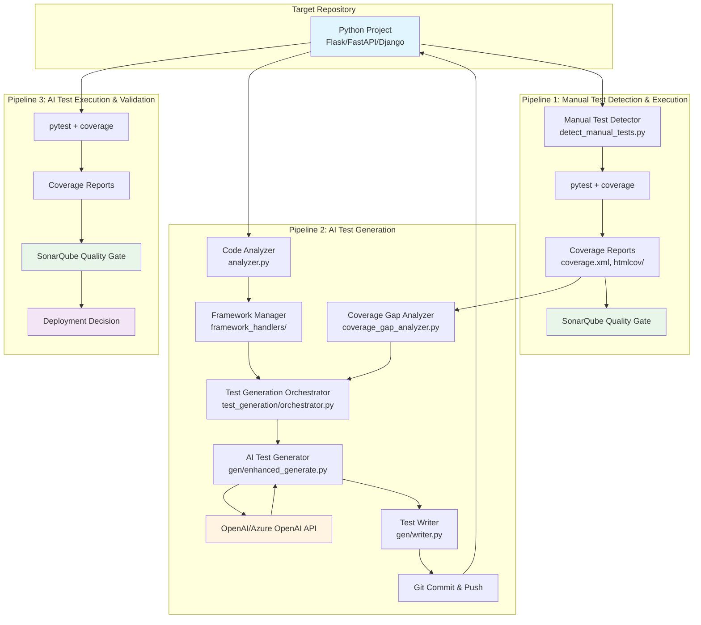
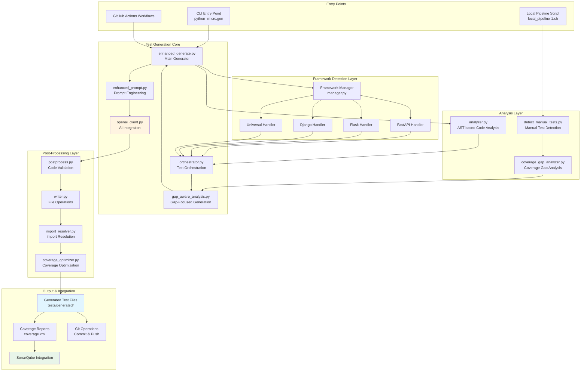
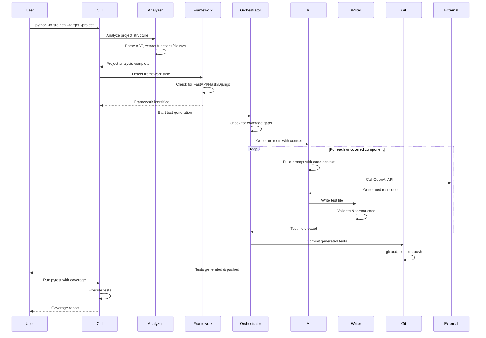
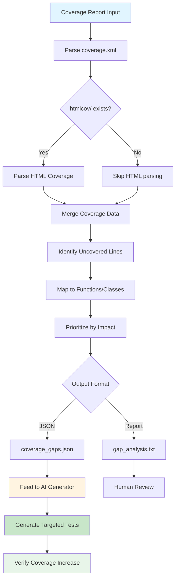
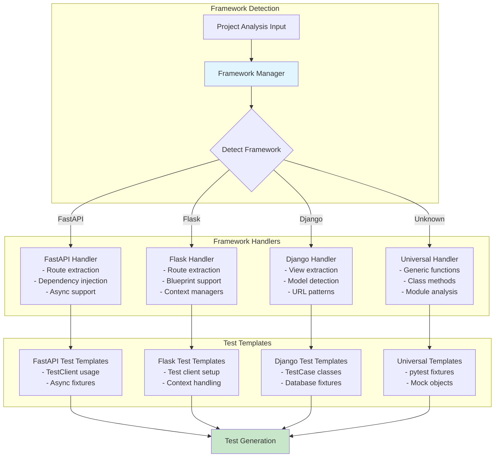
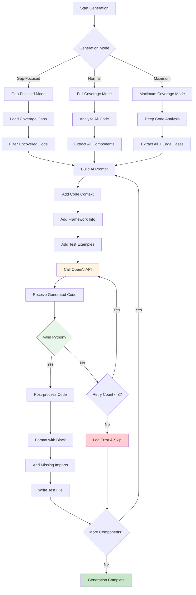
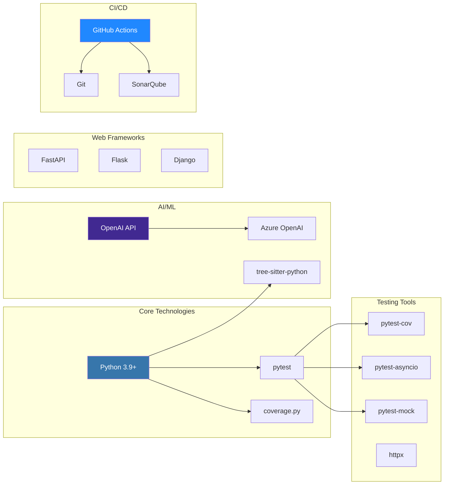

# Architecture Workflow Diagram

## System Overview

This is an **AI-Powered Test Generation System** that analyzes Python projects, detects manual tests, and generates intelligent test coverage using AI.

## High-Level Architecture



## Detailed Component Architecture



## Data Flow Architecture



## Pipeline Flow Architecture

```mermaid
flowchart LR
    subgraph "Pipeline 1: Manual Test Analysis"
        P1_START[Start] --> P1_DETECT[Detect Manual Tests]
        P1_DETECT --> P1_RUN[Run Manual Tests]
        P1_RUN --> P1_COV[Generate Coverage]
        P1_COV --> P1_SONAR[Quality Gate Check]
        P1_SONAR --> P1_ARTIFACT[Upload Artifacts]
    end

    subgraph "Pipeline 2: AI Test Generation"
        P2_START[Start] --> P2_DOWNLOAD[Download Coverage]
        P2_DOWNLOAD --> P2_ANALYZE[Analyze Gaps]
        P2_ANALYZE --> P2_DETECT_FW[Detect Framework]
        P2_DETECT_FW --> P2_GEN[Generate AI Tests]
        P2_GEN --> P2_VALIDATE[Validate Tests]
        P2_VALIDATE --> P2_COMMIT[Commit & Push]
    end

    subgraph "Pipeline 3: AI Test Validation"
        P3_START[Start] --> P3_PULL[Pull Generated Tests]
        P3_PULL --> P3_RUN[Run AI Tests]
        P3_RUN --> P3_COV[Generate Coverage]
        P3_COV --> P3_SONAR[Quality Gate Check]
        P3_SONAR --> P3_DEPLOY{Pass?}
        P3_DEPLOY -->|Yes| P3_SUCCESS[Deploy Ready]
        P3_DEPLOY -->|No| P3_FAIL[Fix Required]
    end

    P1_ARTIFACT -.->|Triggers| P2_START
    P2_COMMIT -.->|Triggers| P3_START

    style P1_SONAR fill:#e8f5e9
    style P3_SONAR fill:#e8f5e9
    style P2_GEN fill:#fff4e1
    style P3_SUCCESS fill:#c8e6c9
    style P3_FAIL fill:#ffcdd2
```



## Coverage Gap Analysis Flow



## Framework Handler Architecture



## AI Test Generation Workflow



## Technology Stack



## Key Features

### 1. Universal Project Support
- Works with any Python project structure
- Supports flat, nested, and package-based layouts
- Framework-agnostic with specialized handlers

### 2. Intelligent Gap Detection
- Analyzes coverage reports (XML + HTML)
- Identifies uncovered functions, classes, and methods
- Prioritizes test generation for maximum impact

### 3. Framework-Aware Generation
- Detects FastAPI, Flask, Django, or generic Python
- Uses framework-specific test patterns
- Handles async/sync, routes, views, and models

### 4. AI-Powered Generation
- Uses OpenAI/Azure OpenAI for intelligent test creation
- Context-aware prompts with code analysis
- Generates unit, integration, and E2E tests

### 5. Quality Assurance
- Validates generated code syntax
- Post-processes for import resolution
- Integrates with SonarQube for quality gates

### 6. CI/CD Integration
- Three-pipeline GitHub Actions workflow
- Automated test execution and validation
- Coverage tracking and reporting

## Usage Patterns

### Pattern 1: Full Generation
```bash
python -m src.gen --target ./my-project
```
Generates comprehensive test suite for entire project.

### Pattern 2: Gap-Focused Generation
```bash
export GAP_FOCUSED_MODE=1
python -m src.gen --target ./my-project
```
Generates tests only for uncovered code.

### Pattern 3: Pipeline Orchestration
```bash
./local_pipeline-1.sh
```
Runs complete workflow: detect → analyze → generate → test.

### Pattern 4: GitHub Actions
Push to repository triggers automated three-pipeline workflow.

## Configuration

### Environment Variables
- `TARGET_ROOT` - Target project directory
- `COVERAGE_MODE` - Coverage optimization mode
- `AZURE_OPENAI_ENDPOINT` - AI service endpoint
- `AZURE_OPENAI_API_KEY` - AI service API key
- `GAP_FOCUSED_MODE` - Enable gap-focused generation

### Configuration Files
- `pytest.ini` - Pytest configuration
- `requirements.txt` - Python dependencies
- `.github/workflows/*.yml` - CI/CD pipeline definitions

## Output Artifacts

### Generated Files
- `tests/generated/test_*.py` - AI-generated test files
- `coverage.xml` - Coverage report (Cobertura format)
- `htmlcov/` - HTML coverage report
- `coverage_gaps.json` - Gap analysis results
- `manual_test_result.json` - Manual test detection results

### Reports
- Coverage percentage and statistics
- Gap analysis with prioritization
- Test generation logs
- SonarQube quality metrics

---

**Version:** 1.0
**Last Updated:** 2025-11-25
**Project:** AI-Powered Test Generation System
